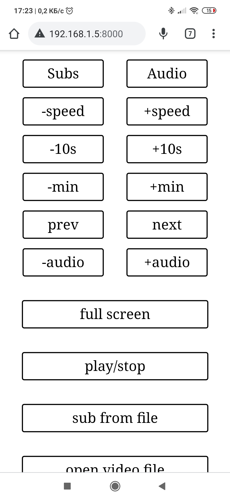
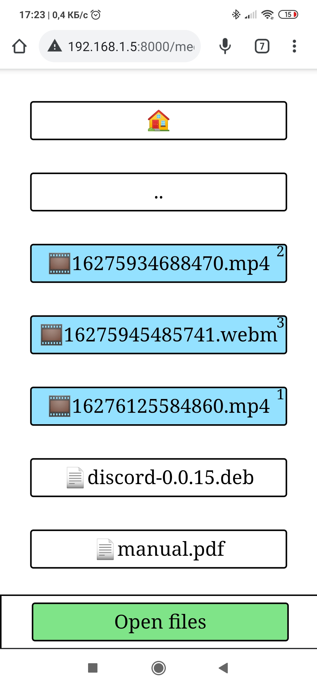

# MPV remote controller

MPV remote controller is a program for remote controlling mpv player with device in your local network through web browser.

## Features
- switch subtitles/audio
- controlling speed
- pause/play
- fullscreen
- next/prev file in playlist
- controlling volume
- subtitles from file
- append media file to playlist
- open media file and start mpv

## Requirements
- [python 3](https://www.python.org/)

## Usage
#### Run server

```sh
python mpv-remote.py
```
Now open your browser, go to **your_local_ip:8000** and enjoy the remote domination over mpv.
> **_NOTE:_**  by default mpv-remote use port 8000 and ip 0.0.0.0. You can change it by change SERVER_ADRESS var in mpv-remote.py

#### Open files by double click
If you want controlling mpv which was opened by double click on media file, you should add in your mpv.conf next line
```
input-ipc-server=/tmp/mpvsocket
```
> **_NOTE:_**  If you prefer use different path, you need to change SOCKET_PATH in mpv-remote.py

## Screenshots

<p align="center">


</p>
